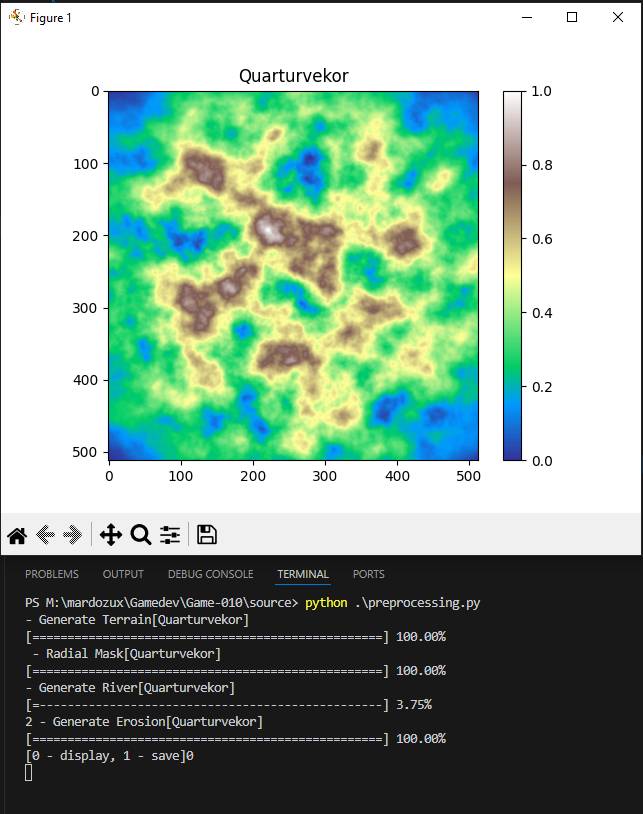

# python-sandbox

a python libs to practice pythonices and some script

## Generate Terrain

<table>
    <tbody>
        <tr>
            <td>Generate Terrain (<a href="pysandbox/terrain/readme.md">Usage</a>)</td>
        </tr>
        <tr>
            <td></td>
        </tr>
    </tbody>
</table>